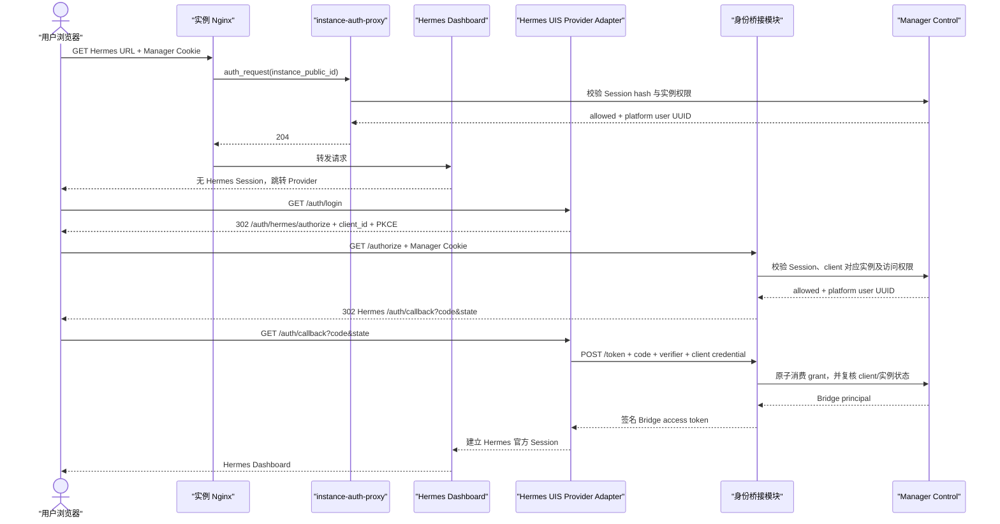

# Hermes UIS OAuth2 身份桥接设计

## 1. 状态

- 状态：Slice 1–4 已实现；现有实例仍需显式逐实例迁移
- 目标版本：Hermes Agent `v2026.7.20`
- 认证来源：现有 Manager `campus-uis` OAuth2 登录
- 相关研究：[Hermes Dashboard 接入校内 UIS 的可行性研究](../research/hermes-dashboard-sso.md)

本文只定义目标架构、接口和安全不变量，不授权部署、数据库迁移或生产配置变更。

## 2. 背景与目标

OpenClaw Manager 已通过校内 UIS OAuth2 建立平台用户 Session，并在实例入口执行 Owner、成员及管理员授权。Hermes Dashboard 仍要求用户再次输入 Hermes 用户名和密码。

目标是在不切换 Manager 认证模式、不关闭 Hermes 官方认证门的前提下，实现：

1. 用户只完成一次 UIS 登录。
2. 已有 Manager UIS Session 的用户进入 Hermes 时，不再输入 Hermes 密码。
3. Hermes 继续使用官方 `DashboardAuthProvider` 和官方 Session Cookie。
4. Manager 继续作为实例访问授权的唯一元数据权威。
5. 任意来自浏览器的容器名、实例路径、回调地址或身份 Header 都不能成为可信输入。

## 3. 非目标

- 不把 UIS access token 或 refresh token交给 Hermes。
- 不让 Hermes 信任 `X-Remote-User`、`X-Forwarded-User` 或 `X-OpenClaw-Authenticated-User`。
- 不使用 `--insecure` 关闭 Hermes 认证门。
- 不让身份桥接模块代理 Hermes Dashboard 的普通业务流量。
- 不改变 OpenClaw、EvoScientist 或 Manager 本身的认证模式。
- 不在第一版实现跨学校、跨 Provider 或通用 OAuth2 平台。
- 不把平台管理员自动视为实例内容管理员；沿用 Control 当前实例授权规则。

## 4. 术语

### 身份桥接模块

一个深模块：以很小的外部接口完成 Manager Session 验证、实例授权、OAuth2 授权码签发与兑换、PKCE、客户端认证、审计和 Hermes access token 签发。

### Hermes UIS Provider Adapter

运行在 Hermes 内的官方 `DashboardAuthProvider` Adapter。它只理解身份桥接模块的 OAuth2 接口，不读取 Manager Cookie、数据库或 UIS token。

### Bridge client

一个 Hermes 实例在身份桥接模块中的服务端身份。每个实例拥有独立的 `client_id` 和客户端凭据，且只能为自身兑换授权码。

### Bridge grant

一次性、短期有效的授权码记录。它绑定平台用户、Hermes 实例、精确回调地址、PKCE challenge 和 Manager Session；兑换后立即失效。

### Bridge access token

身份桥接模块签发给 Hermes UIS Provider Adapter 的短期签名 token。它只用于建立及验证 Hermes Dashboard Session，不是 UIS token，也不能调用 Manager 管理接口。

## 5. 模块与 seam

### 5.1 外部 seam：OAuth2 兼容接口

身份桥接模块只暴露两个业务接口：

```text
GET  /auth/hermes/authorize
POST /auth/hermes/token
```

可另提供不承载业务语义的只读元数据接口：

```text
GET /auth/hermes/jwks.json
```

调用者不需要理解 Manager Session 存储、实例成员关系、数据库结构、审计实现或签名密钥轮换。这些全部属于模块实现。

### 5.2 内部 seam：身份与实例授权

身份桥接模块通过 Manager Control 的内部接口完成：

```text
resolve_manager_session(session_hash) -> PlatformIdentity
authorize_instance(user_public_id, instance_public_id) -> Allowed | Denied
issue_bridge_grant(...) -> AuthorizationCode
redeem_bridge_grant(...) -> BridgePrincipal
```

上述是模块内部 seam，不直接暴露给浏览器或 Hermes。Control 仍是用户、Session、实例及成员关系的权威。

### 5.3 Hermes seam：DashboardAuthProvider

Hermes Adapter 满足官方认证 Provider 接口，逻辑职责限定为：

- `start_login`：生成 state、PKCE verifier/challenge，并构造 `/authorize` URL。
- `complete_login`：校验 state，通过后端调用 `/token` 兑换授权码。
- `verify_session`：本地验证 Bridge access token 的签名、时效、issuer、audience 和实例绑定。
- `refresh_session`：第一版不签发 refresh token；返回不支持刷新。
- `revoke_session`：清除 Hermes 本地 Session；不撤销 UIS 或 Manager Session。

如果删除该 Adapter，OAuth2 协议、Manager 授权和 token 安全逻辑不会散落到 Hermes 入口配置中，而是仍集中在身份桥接模块。

## 6. 访问时序



当 Manager Session 不存在时，现有入口授权先把用户送到 UIS 登录。完成 UIS 登录后再进入上述流程，因此身份桥接模块本身不重复实现 UIS authorize/token/userInfo 逻辑。

## 7. 外部接口

### 7.1 GET `/auth/hermes/authorize`

请求参数：

```text
response_type=code
client_id=<opaque bridge client id>
redirect_uri=<exact registered Hermes callback>
state=<opaque Hermes state>
code_challenge=<base64url SHA-256 challenge>
code_challenge_method=S256
```

处理规则：

1. 只接受 `response_type=code` 和 `code_challenge_method=S256`。
2. 从 `client_id` 服务端解析实例，不接受请求提供 `instance_id`、容器名或数据路径。
3. `redirect_uri` 必须与该实例登记值逐字匹配。
4. 从 Manager Cookie 解析 Session；Cookie 原文不得写入日志或数据库。
5. 调用 Control 校验用户处于 active 状态，且具备该实例访问权限。
6. 创建随机度至少 256 bit 的授权码，只持久化其 SHA-256 hash。
7. grant 默认 60 秒过期，绑定 user、instance、client、redirect URI、PKCE challenge 和 Manager Session ID。
8. 以 `302` 跳转至登记回调，只返回 `code` 和原始 `state`。

失败语义：

- Manager Session 缺失或失效：跳转 Manager UIS 登录，并保存受控的恢复目标。
- 参数、client 或回调地址无效：`400 invalid_request`。
- 用户没有实例权限：`403 access_denied`，不得跳转到 Hermes。
- Control 或存储不可用：`503 temporarily_unavailable`，fail closed。

### 7.2 POST `/auth/hermes/token`

请求使用 `application/x-www-form-urlencoded`：

```text
grant_type=authorization_code
code=<one-time code>
redirect_uri=<registered callback>
client_id=<bridge client id>
client_secret=<per-instance secret>
code_verifier=<PKCE verifier>
```

处理规则：

1. 端点只允许 HTTPS。
2. 客户端凭据使用恒定时间比较；数据库只保存适合验证的派生值，不保存明文。
3. 以单个数据库事务原子校验并消费授权码，任何失败都不能留下可再次兑换的中间状态。
4. 校验 grant 未过期、未消费，并匹配 client、实例、redirect URI 和 PKCE verifier。
5. 复核实例仍 active、Bridge client 未撤销；用户 active 状态和实例授权以授权时检查为主，兑换时至少复核关键状态。
6. 返回签名 Bridge access token，不返回 UIS token 或 Manager Cookie。

成功响应：

```json
{
  "access_token": "<signed token>",
  "token_type": "Bearer",
  "expires_in": 900
}
```

失败响应遵循 OAuth2 通用错误：`invalid_request`、`invalid_client`、`invalid_grant`、`unsupported_grant_type`。认证失败不区分 client 不存在、secret 错误、授权码不存在或已消费等内部细节。

### 7.3 GET `/auth/hermes/jwks.json`

只发布验证 Bridge access token 所需的公钥。响应必须包含稳定 `kid` 并支持至少一个旧验证密钥的轮换窗口；不得暴露私钥、客户端凭据或内部实例信息。

## 8. Bridge access token

第一版使用非对称签名 JWT，建议 Ed25519/EdDSA；若运行库或 Hermes Provider 不支持，再选择 RS256。禁止使用实例共享的对称签名密钥。

必须包含：

```json
{
  "iss": "https://<manager-public-host>/auth/hermes",
  "aud": "<bridge-client-id>",
  "sub": "<platform-user-uuid>",
  "instance_id": "<instance-public-uuid>",
  "provider": "campus-uis",
  "iat": 0,
  "exp": 0,
  "jti": "<random-token-id>"
}
```

验证规则：

- 只接受允许列表中的算法，禁止由 token 自己选择任意算法。
- 校验签名、`kid`、`iss`、`aud`、`exp`、`iat`、`sub`、`instance_id` 和 `provider`。
- `aud` 必须等于当前 Hermes 实例的 `client_id`。
- `instance_id` 必须等于该容器启动时写入的固定实例 UUID。
- `sub` 必须是合法平台用户 UUID。
- 默认有效期 15 分钟，不签发 refresh token。

15 分钟过期后 Hermes 重新走授权流程；因为 Manager Session 已存在，正常用户只经历无感重定向。实例入口的 `auth_request` 仍会在每次请求校验当前平台 Session 和实例权限，因此成员撤销不依赖 Bridge token 到期。

## 9. 数据模型

建议新增两张表，具体 schema 版本由实现 PR 决定。

### `hermes_auth_clients`

```text
id                    internal primary key
instance_id           unique foreign key -> instances.id
client_id             unique opaque identifier
client_secret_hash    verification-only derived value
redirect_uri          exact HTTPS callback
created_at
rotated_at             nullable
revoked_at             nullable
```

每个 Hermes 实例最多一个 active client。删除、回收或永久删除实例时必须撤销 client；恢复实例默认轮换 secret，不能沿用已暴露的旧凭据。

### `hermes_auth_grants`

```text
code_hash              primary key
client_id              foreign key -> hermes_auth_clients.id
instance_id            foreign key -> instances.id
user_id                foreign key -> users.id
manager_session_id     foreign key or stable internal reference
redirect_uri
code_challenge
created_at
expires_at
consumed_at             nullable
```

过期和已消费记录可按保留策略清理，但清理不能在授权或兑换请求的关键路径中造成长事务。日志和审计只记录 grant 的不可逆短标识，不记录原始 code。

## 10. 密钥与配置

### Manager 侧

```text
HERMES_AUTH_BRIDGE_ISSUER
HERMES_AUTH_BRIDGE_SIGNING_KEY_HOST_FILE
HERMES_AUTH_BRIDGE_SIGNING_KEY_FILE
HERMES_AUTH_BRIDGE_SIGNING_KEYS=kid-current=/run/secrets/current.pem,kid-old=/run/secrets/old.pem
HERMES_AUTH_BRIDGE_ACTIVE_KID
HERMES_AUTH_BRIDGE_GRANT_TTL_SECONDS=60
HERMES_AUTH_BRIDGE_TOKEN_TTL_SECONDS=900
```

签名私钥必须以只读文件挂载到承载身份桥接实现的进程，不进入仓库、数据库、镜像层或普通环境导出。公钥通过 JWKS 发布。

### Hermes 实例侧

```text
HERMES_UIS_BRIDGE_ISSUER
HERMES_UIS_BRIDGE_CLIENT_ID
HERMES_UIS_BRIDGE_CLIENT_SECRET
HERMES_UIS_BRIDGE_INSTANCE_ID
HERMES_DASHBOARD_PUBLIC_URL
```

实例 secret 写入 Hermes 私有 `.env`，文件权限保持 `0600`，不显示在 Manager 页面、操作输出或审计详情中。创建、恢复和轮换使用一次性 provisioning secret，沿用现有敏感信息处理原则。

## 11. 网络拓扑

- 浏览器只通过公开 TLS Nginx 访问 Manager 与 Hermes。
- `/auth/hermes/authorize`、`/token` 和 `/jwks.json` 位于固定 Manager 公网来源，不为每个实例暴露新端口。
- Hermes Provider 的 `/token` 与 JWKS 调用通过 HTTPS 访问固定 Manager URL。
- Hermes 容器不加入 `manager-net` 或 `instance-auth-net`，不获得直接调用 Control 的能力。
- `instance-auth-proxy` 继续只处理 Nginx `auth_request`，不保存授权码、签名密钥或 client secret。
- Nginx 必须覆盖或移除来自客户端的身份相关 Header，且不得记录 query 中的 authorization code。

身份桥接实现可以与 `manager-user-web` 同进程部署，但在代码中必须保持独立深模块；也可以后续独立进程部署。第一版不为假设的未来部署方式提前引入远程 seam。

## 12. Session 与注销语义

### Hermes 注销

Hermes `/auth/logout` 只清除 Hermes Session。Manager UIS Session 仍有效，因此再次进入实例会自动建立新 Hermes Session。这是“退出产品”而非“退出平台”。

### Manager 注销或 UIS 单点注销

Manager Session 失效后，实例 Nginx 的 `auth_request` 立即拒绝访问，即使浏览器仍持有未过期 Hermes Session。用户重新登录 UIS 后可以再次建立访问。

### 成员撤销、用户停用或实例回收

Control 的入口授权立即阻止访问。Bridge access token 不作为绕过入口授权的凭据；实例 client 同时应在回收或删除事务中撤销。

第一版不要求建立跨系统实时 token revocation list，因为每请求的入口授权已经提供即时阻断，Bridge token 仅 15 分钟有效。该决定必须在威胁模型变化时重新评估。

## 13. 安全不变量

1. 只有 Control 从服务端元数据解析实例与权限。
2. 浏览器不能指定可信容器名、数据路径、用户 ID 或任意回调地址。
3. 授权码随机度至少 256 bit、只保存 hash、60 秒过期、只能成功消费一次。
4. 所有授权码都绑定 S256 PKCE、client、实例、回调地址和 Manager Session。
5. 每个 Hermes 实例使用独立 client secret；一个实例泄漏不能兑换其他实例的 grant。
6. Bridge token 使用非对称签名，并绑定 audience 与 instance UUID。
7. UIS token 和 Manager Cookie 永不进入 Hermes。
8. Bridge token 永不授权 Manager Control、Executor 或其他实例。
9. Manager Session、实例授权、client、grant、签名或存储任何一项异常都 fail closed。
10. code、verifier、client secret、Cookie、UIS token 和完整 Bridge token 不得进入日志。
11. Nginx、Manager 和 Hermes 的外部流量必须使用 TLS；不允许通过 HTTP 降级。
12. 认证实现不得复用 `MANAGER_CONTROL_*_TOKEN` 或 Model Proxy token。

## 14. 威胁模型

| 威胁 | 控制措施 |
|---|---|
| 恶意回调地址窃取 code | 每实例精确登记并逐字匹配 HTTPS redirect URI |
| 授权码被截获 | S256 PKCE、60 秒 TTL、单次消费、TLS |
| 授权码重放 | 原子设置 `consumed_at`，重复兑换统一返回 `invalid_grant` |
| 一个 Hermes 实例冒充另一个实例 | 独立 client secret，grant 和 token 同时绑定 client 与 instance |
| 浏览器伪造身份 Header | 身份只来自 Manager Session 与 Control，不读取可信身份 Header |
| Bridge token 跨实例使用 | 校验 `aud` 和 `instance_id` |
| 签名算法降级 | 固定算法允许列表，按 `kid` 取可信 JWKS key |
| 用户权限被撤销后继续访问 | 每请求 Nginx `auth_request` 复核 Control 授权 |
| Manager Session 固定或 CSRF | 复用现有 Session 安全策略；OAuth state + PKCE；只允许受控恢复目标 |
| client secret 泄漏 | 每实例隔离、私有文件、可轮换、删除/恢复时撤销 |
| 日志泄密 | 结构化字段允许列表、敏感字段统一 redaction、回归测试 |
| Control/Bridge 故障时绕过 | 所有异常返回拒绝或 503，不回退到 Basic、Header 或 insecure 模式 |

## 15. 审计

至少记录：

- `hermes_auth.authorize.success|denied|error`
- `hermes_auth.token.success|denied|error`
- `hermes_auth.client.create|rotate|revoke`

允许字段：request ID、实例 UUID、平台用户 UUID、client ID 的短 hash、结果、错误类别、来源 IP 的现有隐私处理结果、时间戳。

禁止字段：Manager Cookie、UIS token、authorization code、PKCE verifier、client secret、签名私钥、完整 Bridge token。

授权码签发与审计应在同一事务中提交；client 创建、轮换、撤销与相应实例状态变化也必须保持数据一致性。

## 16. 失败与恢复

- `/authorize` 失败不得创建部分 grant。
- `/token` 在签发响应前必须完成原子消费；响应丢失后不得允许相同 code 再次兑换，客户端重新发起授权。
- 签名失败、JWKS 不可用或 key 未识别时，Hermes 拒绝 Session 并重新登录，不回退 Basic Auth。
- 部署新 Provider 前保留现有 Basic Auth 配置作为显式回滚材料，但同一生产入口不能同时把 Basic 当作自动降级路径。
- 回滚时恢复旧 Hermes Provider 配置并重启目标 Hermes 实例；撤销 Bridge client，清理过期 grant。不得删除 Manager UIS 身份或平台用户。

## 17. 自动化测试

### 身份桥接模块

- 有效 Manager Session、实例权限和登记回调能够签发 grant。
- 未登录、停用用户、非成员、停用实例和撤销 client 全部拒绝。
- 任意 redirect URI、实例 ID、client ID、PKCE method 或恢复目标均拒绝。
- code 只保存 hash，TTL 正确。
- 并发兑换同一 code 时恰好一次成功。
- 错误 secret、verifier、redirect URI、client、过期或已消费 code 均返回统一安全错误。
- token claims、签名、`kid` 和 TTL 正确。
- 日志与审计不包含所有禁止字段。

### Hermes UIS Provider Adapter

- state 与 PKCE 正确生成和校验。
- 正确处理成功 token、OAuth2 错误、超时、非 JSON 响应和签名失败。
- 拒绝错误 issuer、audience、instance、subject、算法、签名、过期时间和未知 `kid`。
- JWKS 轮换时新旧验证 key 在窗口内行为正确。
- 不能通过客户端身份 Header 建立 Session。

### 端到端

- 未登录用户先完成 UIS 登录，再无密码进入 Hermes。
- 已登录用户通过无感重定向进入 Hermes。
- 非 Owner/成员无法进入，且拿不到 grant。
- 成员撤销后，现有 Hermes Session 的下一次请求被入口拒绝。
- Hermes、Bridge 或 Control 重启不产生绕过或永久卡死。
- WebSocket 与普通 API 使用相同 Hermes Session 验证结果。
- Hermes logout、Manager logout 和 UIS logout 符合第 12 节语义。

每条新增或修改的可执行安全规则都必须有对应自动化测试；涉及实例 client 与 grant 数据一致性的规则还必须同步加入 `check_metadata_consistency.py` 或专用校验脚本。

## 18. 生产验收

先只部署一个非生产 Hermes 实例：

1. `/api/status` 显示 Hermes 认证门开启，Provider 为预期 UIS Adapter。
2. 浏览器无 Manager Session 时不能访问 Dashboard、API 或 WebSocket。
3. 已登录 UIS 时不出现 Hermes密码页面。
4. 抓取网络请求确认只有短期 code 经过浏览器，UIS token、client secret 和 Bridge token 不出现在 URL。
5. 篡改 state、code、callback、client、PKCE 或 Cookie 全部失败。
6. 撤销实例成员后下一次请求立即被拒绝。
7. 检查 Manager、Nginx、Hermes 和审计日志不存在敏感字段。
8. 轮换 Bridge signing key 和单实例 client secret，验证不中断其他实例。

## 19. 分阶段实施

### Slice 1：纯模块与持久化

- schema migration：Bridge client 与 grant。
- Control 内部授权、签发、原子兑换逻辑。
- 签名与 JWKS 模块。
- 单元测试、并发兑换测试和一致性检查。

该阶段不改变任何实例入口。

### Slice 2：公开桥接接口

- Manager Web `/authorize`、`/token`、`/jwks.json`。
- Nginx 精确路由、限速和日志脱敏。
- 集成测试与审计。

该阶段仍不迁移现有 Hermes。

### Slice 3：Hermes Provider PoC

- 实现 `campus-uis-bridge` DashboardAuthProvider Adapter。
- 为一个测试实例创建 client、注入配置并重启。
- 完成端到端和攻击用例验证。

### Slice 4：受控迁移

- 新 Hermes 创建流程默认配置 Bridge Provider。
- 提供只读 preview 和显式 `--apply` 的历史实例迁移脚本。
- 备份原 Basic Auth 配置、逐实例迁移、失败自动回滚。

## 20. 实现记录（2026-08-12）

- 公开 Bridge 由 `manager-user-web` 承载，Control 保持 Session、实例授权、grant、client 与签名权威。
- `campus-uis-bridge` 使用 Hermes `v2026.7.20` 的官方 keyword-only Provider 接口及八字段 `Session`；不提供 discovery 或 ID Token。
- 新 Hermes 实例在容器启动前安装并启用 Provider、登记独立 client；失败沿现有创建事务回滚。
- `scripts/migrate_hermes_uis_auth.py` 默认 preview，必须提供精确实例 UUID 和 `--apply` 才修改文件、client 并重启该实例。
- 更新运行时安全检查、元数据一致性检查和部署文档。

## 20. 决策摘要

- 保持 Manager `campus-uis` OAuth2 模式，不改用 OIDC。
- 不关闭 Hermes 认证；使用官方 `DashboardAuthProvider` Adapter 建立 Hermes Session。
- 集中式身份桥接模块复用 Manager Session，不让每个 Hermes 直接持有 UIS client secret。
- 使用 authorization-code + S256 PKCE、单次短期 grant、每实例 Bridge client 和非对称短期 token。
- 保留入口 `auth_request` 作为实时实例授权，Bridge token 只承担 Hermes 产品 Session 身份。
- 第一版不发 refresh token，通过已有 Manager Session 无感重新授权。
